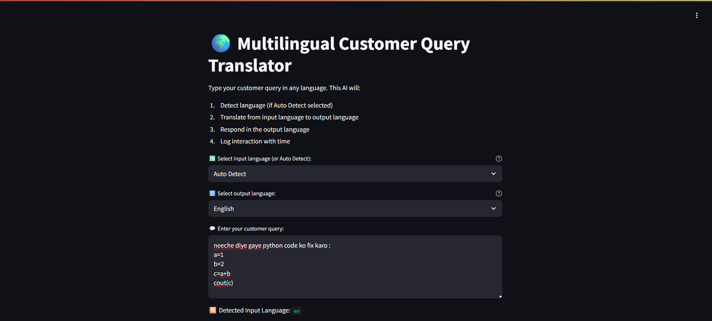
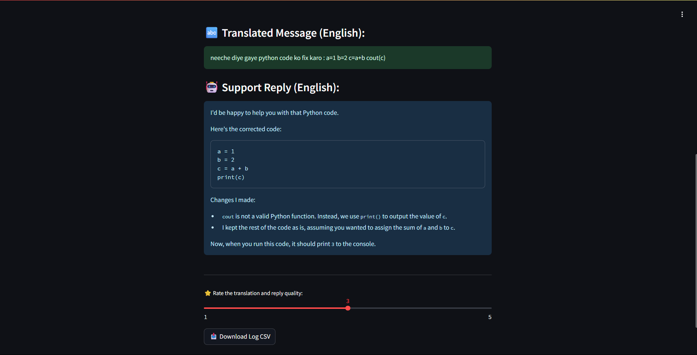

# Real-Time Multilingual Query Handler

This project is automatically generated.

## Installation

```sh
pip install -r requirements.txt
```
# 🚀 Neon Multilingual AI Translator by SHASHANK


A **futuristic AI-powered translator and customer support tool** that:
- 🧠 Detects any language automatically or language can be chosen among 110+ languages.
- 🌐 Translates to English or 110+ languages using Groq-hosted **LLaMA 3**
- 🤖 Responds with a friendly AI message
- 🔁 Translates the reply back to the customer's native language
- 🗂️ Logs everything with timestamps and ratings
- 💾 Supports CSV export
- 💡 Comes with a neon, next-gen UI

---

## 📸 Preview




---

## ⚙️ Features

- 🔎 Auto language detection with `langdetect`
- 🌍 Multilingual support
- 🤝 Friendly AI support replies
- 💬 Neon-themed modern UI
- 📥 Downloadable chat log
- ⭐ Rating & feedback

---

## 🛠️ Setup & Run (VS Code or GitHub Codespace)

### 🔧 1. Clone this Repo

```bash
git clone https://github.com/shashankkumarlal/real-time-multilingual-translator.git
cd real-time-multilingual-translator
```
### 2.Install Dependencies
```bash
pip install streamlit langchain langchain_groq langdetect pandas
```
### 3.Set Up Your Groq API Key
```bash
export GROQ_API_KEY=your_groq_api_key_here
```
### 4.Run the App
```bash
streamlit run main.py
```
TO RUN IN CODESPACE:
```bash
streamlit run app.py --server.port 8501 --server.address 0.0.0.0
```


